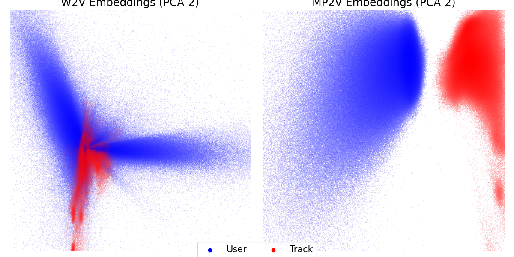
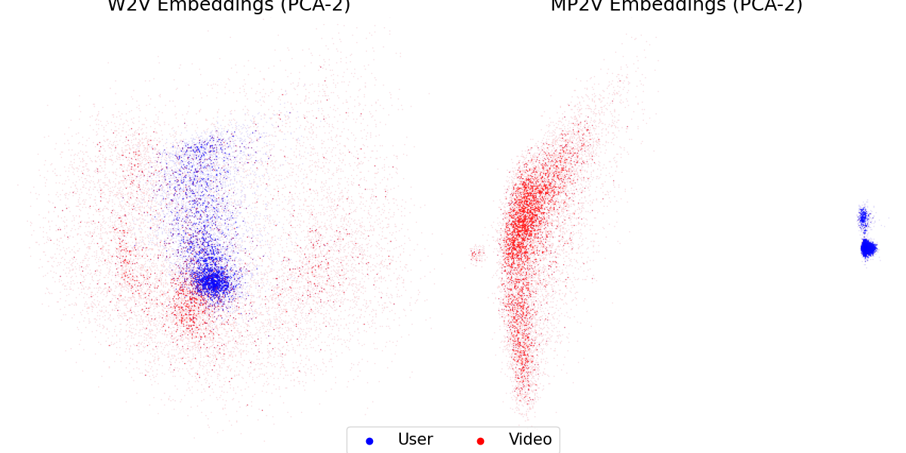
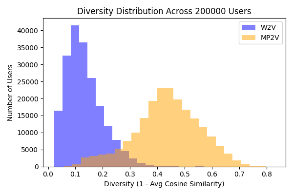
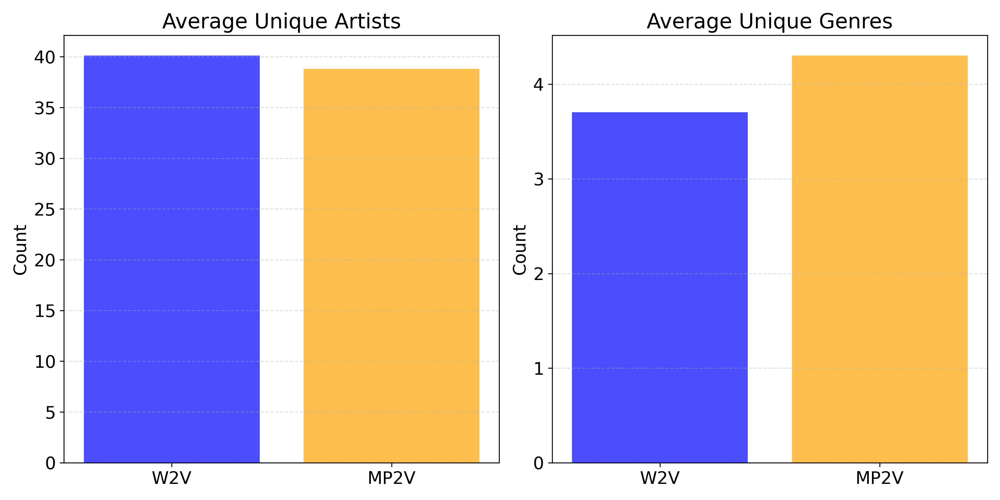
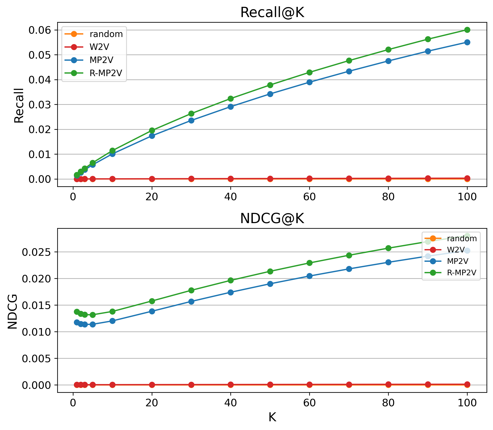

# MP2V-4-Rec: Scalable Graph-Based Recommendation Systems

## Project Summary
This project investigates scalable graph-based representation learning for personalized recommendations on large-scale streaming platforms, focusing on SoundCloud and Kuaishou (via the KuaiRec dataset). Traditional approaches like Word2Vec often fail to capture complex user-content and social interactions. We introduce **Metapath2Vec (MP2V)** to recommendation research, enhancing it with weighted random walks (R-MP2V) to reflect interaction quality. Using SoundCloud’s production-scale data—9 million users, 13 million tracks, and over 21 million social connections—and the reproducible KuaiRec dataset, we benchmark MP2V and R-MP2V against baselines and state-of-the-art methods like UltraGCN. Ablation studies on KuaiRec assess social relationships, embedding initialization, and metapath sampling strategies. MP2V proves highly scalable, delivers competitive performance, and is being deployed at SoundCloud for playlist curation and personalization—marking its first use in a production-scale music recommender system. These findings offer actionable insights for real-world streaming applications.

## Data
- **SoundCloud**: Sourced from production logs (90-day period, 2024), covering 9M active users and 13M tracks. Processed by filtering active users (≥10 interactions) and tracks (≥5 interactions), aggregating 687M interactions with scores (plays: 1/3, likes/reposts: 1.0, decayed over 1-year half-life). Social graph (21.6M follows) derived from 2 years of follow data. Proprietary—contact SoundCloud for access.
- **KuaiRec**: Publicly available from Kuaishou (62-day period), fully observed matrix (7,176 users, 10,728 videos, 12.53M interactions; small subset: 1,411 users, 3,327 videos, 4.67M interactions). Interactions defined as watch ratio ≥2, unprocessed beyond author-provided format. Downloadable at [KuaiRec repository](https://kuairec.com/).

## Key Figures
Below are selected visualizations from the results:

- **SoundCloud PCA Embeddings**: Comparing W2V and MP2V embedding spaces on SoundCloud (9M users, 13M tracks).
  

- **KuaiRec PCA Embeddings**: Visualizing W2V and MP2V embeddings on KuaiRec.
  

- **.SoundCloud Diversity Histogram**: Diversity distribution (1 - avg cosine similarity) of top-100 recommendations for 200,000 users.
  

- **SoundCloud Feature Diversity**: Unique artists and genres in top-100 recommendations.
  

- **SoundCloud Recall@K and NDCG@K Trends**: Performance across K values (10, 20, 50, 100).
  

## Setup
To replicate the environment used in this project, use the provided `environment.yaml` file:
```bash
conda env create -f environment.yaml
conda activate mp2v4rec
